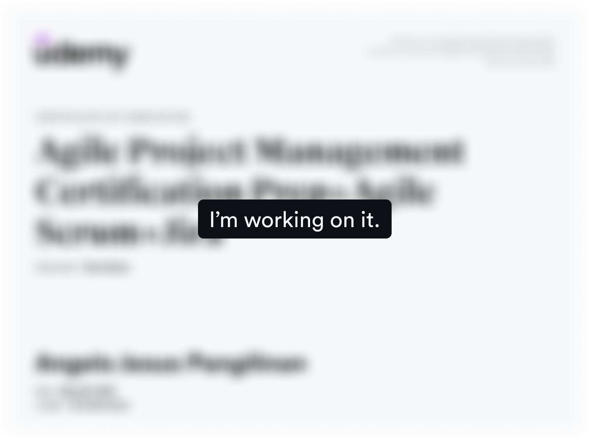

## 100 Days of Code: Python Pro Bootcamp
*By* ***Angela Yu*** *@Udemy*

📚  A daily log of my progress through the Udemy course  
“100 Days of Code: The Complete Python Pro Bootcamp”  
You can check out the official course page [here](https://www.udemy.com/course/100-days-of-code).

---

### 🚀 About

This repository contains my solutions, notes, and mini-projects as I work through the 100 Days of Code Python bootcamp.  
Each “day” lives in its own folder, so I can track my progress and revisit any lesson later.

---

### 🗂️ Certificate of Completion

 *Verify using code: 9DE783BC09A90SF8734B* </img>